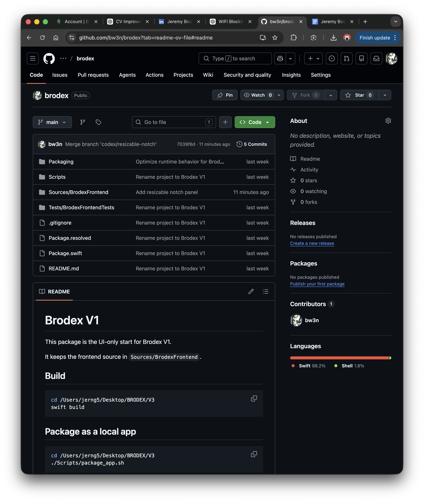

# Brodex

Brodex is a macOS notch utility app that keeps a persistent terminal session in
a compact floating panel.

It is built for a fast, low-friction workflow:
- hover the notch to preview it
- open into a larger terminal panel when you need it
- keep the same shell session alive between opens
- drop files into the panel to insert paths into your prompt

## Download

Download the latest app from GitHub Releases once a release is published.

For early friend-sharing builds, use the packaged artifact:

```text
dist/Brodex.app.zip
```

Because this version uses ad-hoc signing instead of a paid Apple Developer ID,
macOS may ask people to use right-click > `Open` the first time they launch it.

## Preview



## Features

- Persistent shell session inside a notch-style floating panel
- Resizable expanded terminal view
- Drag-and-drop file path insertion
- Menu bar utility app with no Dock icon
- Packaged as a standalone macOS `.app`

## Package The App

```bash
swift build
./Scripts/package_app.sh
```

This creates:

```text
dist/Brodex.app
dist/Brodex.app.zip
```

The packaging script looks for an optional icon at:

```text
Packaging/BRODEX.png
```

If that file is missing, it generates a fallback icon automatically.

## Share With Friends

1. Run `./Scripts/package_app.sh`
2. Upload `dist/Brodex.app.zip` to a GitHub Release
3. Share the Release link

## Local Development

```bash
swift build
swift run
```

## Project Structure

- `Sources/BrodexFrontend`: app source
- `Scripts/package_app.sh`: app bundle and zip packaging
- `Packaging/Info.plist`: app bundle metadata
